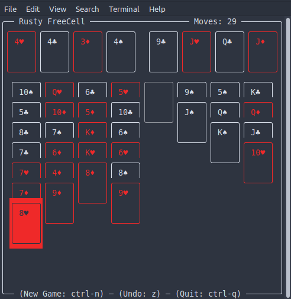

# Rusty FreeCell

A [FreeCell](https://en.wikipedia.org/wiki/FreeCell) solitaire card game in Rust, with a text-based user interface. Uses [crossterm](https://github.com/crossterm-rs/crossterm) for TUI output.



## How To Play

For FreeCell solitaire rules, [check Wikipedia](https://en.wikipedia.org/wiki/FreeCell).

### Controls

<kbd>←</kbd> (or <kbd>A</kbd>) - Move cursor left

<kbd>→</kbd> (or <kbd>D</kbd>) - Move cursor right

<kbd>SPACE</kbd> (or <kbd>ENTER</kbd>) - Select/move card

<kbd>Z</kbd> - Undo (step back in history)

<kbd>F</kbd> - Quick stack all visible cards to foundation (recursive)

<kbd>H</kbd> - Toggle high contrast display mode

<kbd>CTRL</kbd> + <kbd>N</kbd> - New Game

<kbd>CTRL</kbd> + <kbd>Q</kbd> - Quit to terminal

## Building/Running

To build and run Rusty FreeCell, [install Rust using rustup](https://www.rust-lang.org/tools/install). Then in the source directory:

```
cargo run --release
```

## Documentation

See: [rusty-freecell documentation](https://www.maxlaumeister.com/software/rusty-freecell/docs/rusty_freecell/)

Documentation for rusty-freecell is automatically generated from the `main` branch using a GitHub action. 
